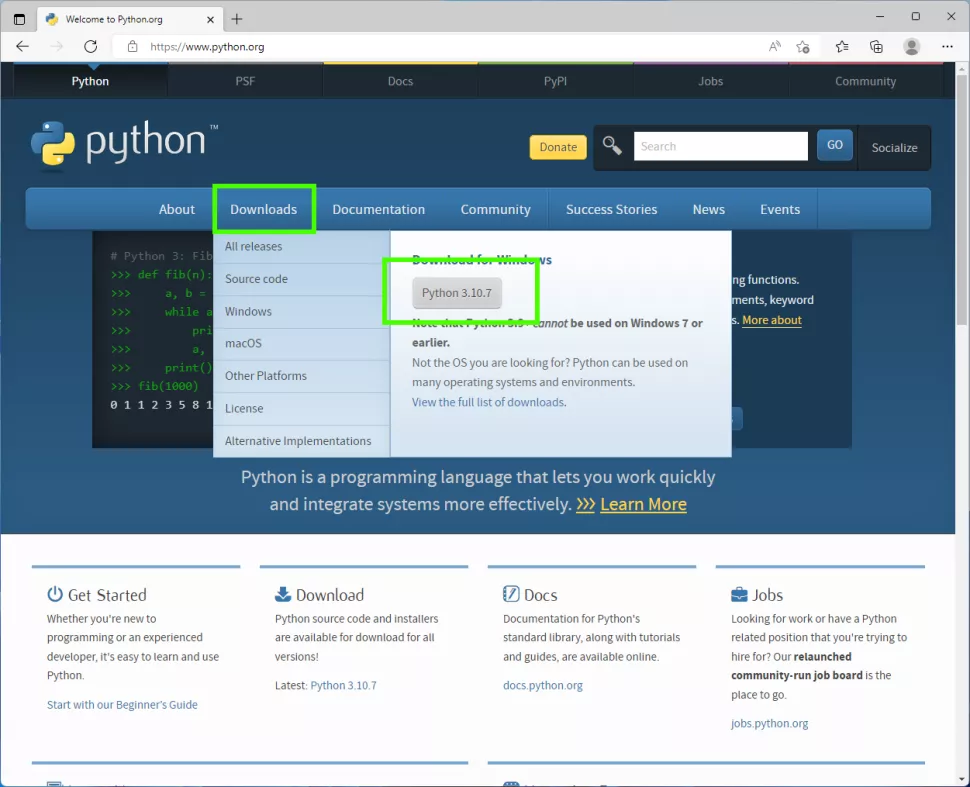

# VARIABLE

**Ózgeriwshi** - qandayda bir atqa iye bolģan kompyuter yadınıń bir bólegi. Ózgeriwshiniń atı hám mánisi boladı. Ózgeriwshiniń atı arqalı mánis saqlanģan yad bólegine múrajaat etiw múmkin. Programma islew waqtında ózgeriwshiniń mánisin ózgerte alamız. Hár qanday ózgeriwshini isletiwden aldın, onı jaratıw kerek.

Eger túsinbegen bolsańız ápiwayı mısal menen túsindiremen. Kóz aldımızģa keltireyik: Biz hámme nárselerimizdi qutılarda saqlaymız, kitaplarımız bir qutıda, kiyimlerimiz basqa bir qutıda hám usı sıyaqlı hámme nársemizdi qutılarģa ajratıp qoyģanbız. Qutılardıń sırtqı kórinisi birdey, biz qutılardı adastırıp almawımız ushın olarģa at qoyamız. Mısal ushın, kitaplarımız turģan qutınıń sırtına "books" dep jazıp qoysaq. Onnan keyin bizge qaysıdur kitabımız kerek bolıp qalsa, tuwrı barıp books degen qutını ashamız. Yaģıniy qutılarģa at qoyıw arqalı, olarda ne saqlanģanın tez hám qıynalmastan tawıp alamız. Ózgeriwshilerdi de qutılarģa uqsatıw múmkin.

<figure><figcaption><p>Ishinde saqlanģan buyımlarģa (maģlıwmatlarģa) qarap at qoyılģan qutılar</p></figcaption></figure>

Python tilinde ózgeriwshi jaratıw, ózgeriwshiniń atına mánisti teńep qoyıw arqalı ámelge asırıladı. Mısal ushın, tómendegi kodımızda `myNum` atlı ózgeriwshi jarattıq hám oģan `4` degen mánis berdik:

```python
myNum = 4
```

Qutılar mısalında aytayuģın bolsaq biz házir taza qutı aldıq, oģan `myNum` dep at qoydıq hám `4` degen sandı qutıģa saldıq.

<figure><figcaption><p>myNum qutısına 4 sanın qoyıw</p></figcaption></figure>

Endi bizge `4` sanı kerek bolıp qalsa, `myNum` atı arqalı shaqırıwımız múmkin. Sebebi, `myNum` ózgeriwshisi ózinde `4` degen mánisti saqlap turıptı. Mısal ushın, `myNum` ózgeriwshisin konsolge shıģarıp kóreyik:

```python
print(myNum)
```

Nátije: `4`

Dawam etemiz, tómendegi mısalda biz `result` atlı ózgeriwshi jarattıq hám oģan `myNum * 2` ni teńep qoydıq:

```python
result = myNum * 2
```

Nátijede biz `result` ózgeriwshisine 8 degen mánisti saqlaģan bolamız. Sebebi biz oģan, `myNum * 2` ni teńegen edik. `myNum` ózgeriwshisi ózinde 4 sanın saqlap turģan edi, biz onı 2 ge kóbeyttik. 4×2=8 bolģanı ushın, `result` ózgeriwshisiniń mánisi 8 ge teń boldı.

<figure><figcaption><p>myNum saqlap turģan mánisti 2 ge kóbeytiw processi</p></figcaption></figure>

```python
print(result)
```

Nátije: `8`


```python
myNum = 4            # myNum ózgeriwshisin jarattıq hám 4 degen mánis berdik
print(myNum)         # myNum ózgeriwshisi saqlaģan mánisti konsolģa shıģaramız
result = myNum * 2   # result ózgeriwshisin jarattıq hám myNum ózgeriwshisi saqlaģan mánisti 2 ge kóbeytkennen payda bolģan mánisti saqlap qoydıq
print(resul)         # result ózgeriwshisi saqlaģan mánisti konsolģa shıģaramız
```



Demek biz, ózgeriwshi ne ekenligin, onı jaratıwdı hám mánis beriwdi úyrenip aldıq. Úyreniwdi jáne dawam etemiz...


## ÓZGERIWSHINIŃ MÁNISIN ÓZGERTIW

Ózgeriwshini jaratqannan soń qállegenshe paydalanıw múmkin. Bıraq, eger siz ózgeriwshige taza mánis berseńiz, saqlanģan dáslepki mánisten ayrılasız:

```python
myNum = 4
myNum = 5
print(myNum)
```

Nátije: `5`

<figure><figcaption></figcaption></figure>

## ÓZGERIWSHILERGE AT QOYÍW


Ózgeriwshilerge at qoyģanda tómendegi qaģıydalarģa ámel etiń:

* Ózgeriwshi atı hárip yamasa tómengi sızıq (\_) penen baslanıwı kerek
* Ózgeriwshi atı sanlar menen baslanıwı múmkin emes
* Ózgeriwshi atında tek ģana latın álippesi háripleri (A-z), cifrlar (0-9) hám tómengi sızıq (\_) qatnasıwı múmkin
* Ózgeriwshige atında boslıq (пробел) bolıwı múmkin emes
* Ózgeriwshi atında úlken-kishi háripler túrlishe qabıl etiledi (`name`, `Name` hám `NAME` úsh túrli ózgeriwshi)


Májbúriy emes, bıraq usınıs etiletuģın qaģıydalar:

* Ózgeriwshi atın kishi háripler menen jazıń
* Ózgeriwshi atında 2 hám onnan kóp sóz qatnassa olardıń arasın tómengi sızıq penen (\_) ajratıń (`full_name = "Turdıbek Jumabaev"`)
* Ózgeriwshige túsinikli at beriń (`a=18` emes `age=18`, `c="Korea"` emes `country="Korea"` h.t.b)
* Sonıń menen birge Pythonda isletiletuģın funkciyalar hám arnawlı gilt sózlerdiń (keywords) atın bermeń. Gilt sózlerdiń dizimi tómende berilgen

Sonıń menen birge Pythonda isletiletuģın funkciyalar hám arnawlı gilt sózlerdiń (keywords) atın bermeń. Gilt sózlerdiń dizimi tómende berilgen

<figure><figcaption></figcaption></figure>

Tómendegi kod arqalıda gilt sózlerdi kóriwińiz múmkin:

```python
import keyword
print(keyword.kwlist)
```

## MÍSALLAR

Búgin úyrengenlerimizdi tákirarlaw ushın bir neshe kodlar jazıp kóremiz.

```python
name = 'Jhon Doe'
age = 22
address = 'Tokyo - Japan'
year_of_birth = 2001
specialty = 'Doctor - dentist'
print(name)
print(age)
print(address)
print(year_of_birth)
print(specialty)
```

Nátije:

`Jhon Doe`

`22`

`Tokyo - Japan`

`2001`

`Doctor - dentist`

```python
my_friend = 'Mike'
age = 19
print('Meniń dostım', my_friend, age, 'jasta')
```

Nátije: `Meniń dostım Mike 19 jasta`

```python
milleti = 'Qazaq'
milleti = 'Qaraqalpaq'
print(milleti)
```

Nátije: `Qaraqalpaq`

## ÁMELIYAT

Tómendegi shınıģıwlardı orınlań:

* `"Sálem Álem"` tekstin taza ózgeriwshige júkleń hám `print()` funkciyası járdeminde konsolge shıģarıń
* Eki ózgeriwshi alıń (`a` hám `b`), olarģa sáykes túrde 20 hám 30 mánislerin beriń. Taza ózgeriwshi jaratıń (máselen `c`) hám taza ózgeriwshige aldınģı eki ózgeriwshi saqlap turģan mánislerdiń qosındısın júkleń. Úshinshi ózgeriwshini (`c` nı) konsolģa shıģarıń
